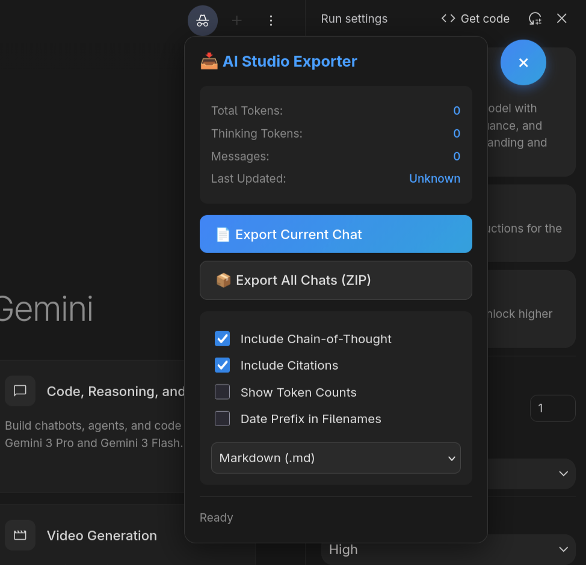

# AI Studio Exporter

A userscript that adds export functionality and UI enhancements to [Google AI Studio](https://aistudio.google.com).

## Features

- **Export conversations** to Markdown, JSON, or HTML
- **Bulk export** all chats as a ZIP file
- **Chain-of-thought included** — captures the model's reasoning traces
- **Citations & sources** preserved in exports
- **Quick action buttons** — Delete and Branch moved to the main toolbar
- **Draggable UI** — position the export button anywhere



## Installation

1. Install a userscript manager:
   - [Tampermonkey](https://www.tampermonkey.net/) (Chrome, Firefox, Edge, Safari)
   - [Violentmonkey](https://violentmonkey.github.io/) (Chrome, Firefox)

2. **[Click here to install the script](https://raw.githubusercontent.com/ShaneIsley/export-aistudio/main/ai-studio-exporter.user.js)**

3. Refresh AI Studio — you'll see a 📥 button in the top-right corner

## Usage

### Export Panel

Click the 📥 button to open the export panel:

- **Export Current Chat** — download the conversation you're viewing
- **Export All Chats (ZIP)** — bulk download all your conversations
- **Options:**
  - Include Chain-of-Thought (model reasoning)
  - Include Citations (grounded search sources)
  - Show Token Counts
  - Date Prefix in Filenames

### Quick Actions

The script adds convenient buttons to each message turn:

| Button | Action |
|--------|--------|
| ⑂ | Branch from this point |
| 🗑️ | Delete this turn |

### Console API

For power users, access the API directly:

```javascript
// List all conversations
await AIStudio.list()

// Get a specific conversation
await AIStudio.get('promptId')

// Search by title
await AIStudio.search('keyword')

// Get token stats (samples first 10 chats)
await AIStudio.stats()
```

## Export Formats

### Markdown
Clean, readable format with metadata header. Great for documentation or importing elsewhere.

### JSON
Full structured data including all metadata, token counts, and citations. Ideal for programmatic processing.

### HTML
Self-contained dark-themed page. Opens directly in any browser.

## License

MIT
